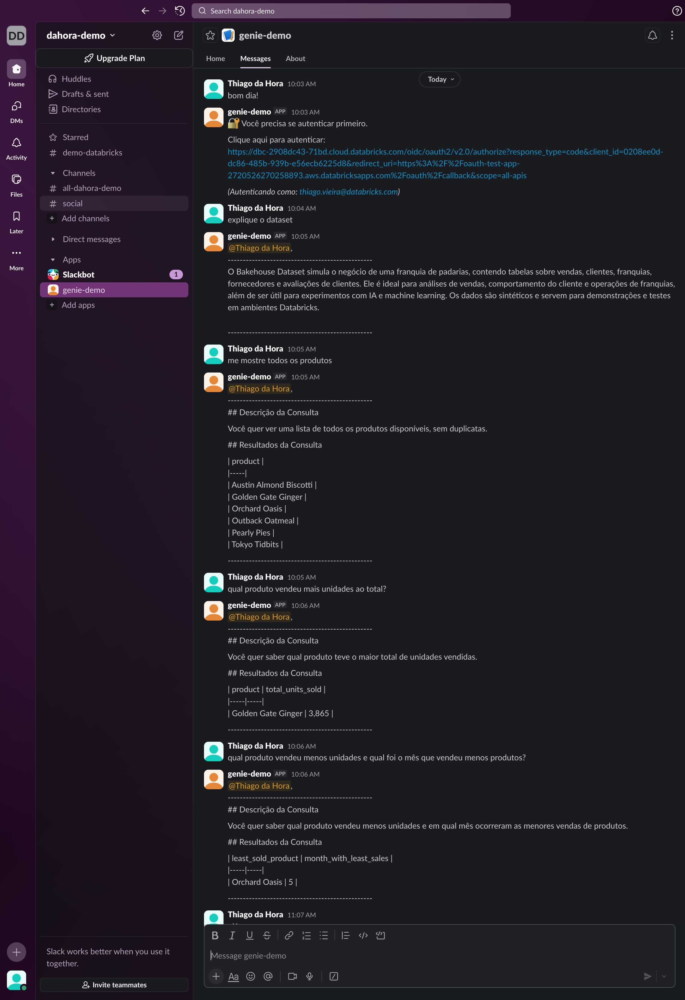

# Genie Slack App with OAuth Multi-User Authentication

Este projeto implementa uma integração entre Slack e Databricks Genie com autenticação OAuth por usuário, permitindo que cada usuário do Slack interaja com o Genie usando suas próprias credenciais do Databricks.

## Arquitetura

O projeto consiste em dois Databricks Apps que trabalham em conjunto:

### 1. oauth-test-app
Serviço de autenticação OAuth responsável por:
- Gerenciar o fluxo de autenticação OAuth 2.0 com Databricks
- Manter tokens de acesso em memória para cada usuário (válidos por 1 hora)
- Expor APIs REST para gerar URLs de login e consultar tokens
- Remover tokens expirados automaticamente

### 2. genie-slack-app
Bot do Slack que:
- Recebe mensagens dos usuários via Socket Mode
- Busca credenciais do usuário no oauth-test-app
- Cria um WorkspaceClient por usuário (não compartilhado)
- Interage com o Databricks Genie usando as credenciais autenticadas do usuário
- Mantém cache de clientes por usuário com invalidação automática

## Fluxo de Autenticação

1. Usuário envia mensagem no Slack para o bot
2. Bot verifica se há token válido em cache para aquele usuário
3. Se não houver token ou estiver expirado, retorna URL de autenticação
4. Usuário clica na URL e autentica no Databricks via OAuth
5. Token é armazenado no oauth-test-app e associado ao email do usuário
6. Bot usa o token para criar WorkspaceClient e consultar Genie
7. Token expira após 1 hora, forçando nova autenticação

## Comunicação Entre Apps

Os apps se comunicam usando **OAuth Client Credentials (Machine-to-Machine)**:
- O `genie-slack-app` obtém token M2M usando `DATABRICKS_CLIENT_ID` e `DATABRICKS_CLIENT_SECRET`
- Usa este token para autenticar chamadas HTTP ao `oauth-test-app`
- Credenciais M2M são **automaticamente injetadas** pelo Databricks Apps como variáveis de ambiente
- Não é necessário configurar manualmente estas credenciais

---

## Guia de Configuração Passo a Passo

A configuração é dividida em 4 etapas principais:

### Etapa 1: Databricks Apps - OAuth App

#### 1.1. Criar o App de Autenticação

1. No Databricks, vá em **Compute** > **Apps**
2. Clique em **Create new app** > **Create a custom app**
3. Nome do app: **`oauth-test-app`**
4. Clique em **Next: Configure** e depois **Create app**

#### 1.2. Preparar o Código para Deploy

**ANTES** de fazer o deploy, você precisa configurar o arquivo `app.yaml`:

1. Copie o arquivo exemplo:
   ```bash
   cd oauth-test-app
   cp app.yaml.example app.yaml
   ```

2. Edite `oauth-test-app/app.yaml` e atualize **apenas** o parâmetro `DATABRICKS_HOST` para refletir sua workspace:
   ```yaml
   env:
     - name: "DATABRICKS_HOST"
       value: "https://sua-workspace.cloud.databricks.com"
   ```

3. **Não preencha** ainda os outros parâmetros (`CLIENT_ID`, `CLIENT_SECRET`, `OAUTH_REDIRECT_URI`) - eles serão preenchidos na Etapa 2

> **Nota sobre expiração de tokens:** O código já está configurado para limpar tokens a cada 10 minutos e limitar a validade a 1 hora (`expires_in = min(expires_in, 3600)`).

#### 1.3. Fazer o Deploy

1. No Databricks, vá para o app `oauth-test-app` que você criou
2. Clique em **Deploy**
3. Selecione a pasta com o código (Workspace > Users > seu-usuario > oauth-test-app)
   - A pasta deve conter: `app.py`, `app.yaml`, `requirements.txt`
4. Clique em **Select** e aguarde o deploy concluir

#### 1.4. Copiar a URL do App

1. Após o deploy, você verá a URL do app no formato:
   ```
   https://oauth-test-app-XXXXXXXXX.aws.databricksapps.com
   ```

2. **Copie esta URL completa** - você precisará dela na próxima etapa

3. **IMPORTANTE:** Lembre-se que o endpoint de callback é:
   ```
   https://oauth-test-app-XXXXXXXXX.aws.databricksapps.com/oauth/callback
   ```
   **Não se esqueça de adicionar `/oauth/callback` ao final!**

---

### Etapa 2: Databricks Account - App Connection

#### 2.1. Criar a App Connection

1. No Databricks, vá em **Settings** (canto inferior esquerdo)
2. Clique em **Developer** > **App connections**
3. Clique em **Create connection**

#### 2.2. Configurar a Connection

1. **Application Name**: `oauth-test-app` (ou qualquer nome descritivo)
2. **Redirect URLs**: Cole a URL do app **com `/oauth/callback`** no final:
   ```
   https://oauth-test-app-XXXXXXXXX.aws.databricksapps.com/oauth/callback
   ```
3. **Access scopes**: Selecione **All APIs** ou **SQL**
4. **Access token TTL (in minutes)**: `60` (1 hora)
5. **Refresh token TTL (in minutes)**: `10080` (7 dias)
6. Clique em **Save**

#### 2.3. Copiar as Credenciais

1. Após salvar, você verá:
   - **Client ID**: Uma string alfanumérica (ex: `abc123def-456g-789h-012i-jklmnopqrstu`)
   - **Client Secret**: Uma string alfanumérica (ex: `secret123abc456def789ghi012jkl345mno678`)

2. **Copie ambos os valores** - você precisará atualizar o `app.yaml`

#### 2.4. Atualizar o app.yaml e Re-deploy

1. Edite `oauth-test-app/app.yaml` e preencha os valores que faltam:
   ```yaml
   env:
     - name: "DATABRICKS_HOST"
       value: "https://sua-workspace.cloud.databricks.com"
     - name: "CLIENT_ID"
       value: "cole-o-client-id-aqui"
     - name: "CLIENT_SECRET"
       value: "cole-o-client-secret-aqui"
     - name: "OAUTH_REDIRECT_URI"
       value: "https://oauth-test-app-XXXXXXXXX.aws.databricksapps.com/oauth/callback"
   ```

2. **Faça um novo deploy** do `oauth-test-app` para aplicar as mudanças:
   - Volte para o app no Databricks
   - Clique em **Deploy** novamente
   - Aguarde a conclusão

---

### Etapa 3: Slack

#### 3.1. Criar a Slack App

1. Acesse https://api.slack.com/apps
2. Clique em **Create New App** > **From scratch**
3. Nome: `genie-demo` (ou qualquer nome)
4. Selecione o workspace onde deseja instalar

#### 3.2. Habilitar Socket Mode

1. No menu lateral, vá em **Settings** > **Socket Mode**
2. Habilite **Enable Socket Mode**
3. Gere um token para o Socket Mode (App-Level Token)
4. **Copie o token** (formato: `xapp-1-...`) - este é o `SLACK_APP_TOKEN`

#### 3.3. Configurar Permissões (Scopes)

1. Vá em **OAuth & Permissions**
2. Em **Bot Token Scopes**, adicione os seguintes scopes:
   - `app_mentions:read` - Ler menções ao app
   - `channels:history` - Ver mensagens em canais públicos
   - `chat:write` - Enviar mensagens
   - `im:history` - Ver mensagens diretas
   - `im:read` - Ver informações de DMs
   - `im:write` - Enviar mensagens diretas
   - `users:read` - Ver informações de usuários
   - `users:read.email` - Ver emails de usuários

#### 3.4. Configurar Event Subscriptions

1. Vá em **Event Subscriptions**
2. Habilite **Enable Events**
3. Em **Subscribe to bot events**, adicione:
   - `app_mention` - Quando alguém menciona o bot
   - `message.im` - Mensagens diretas ao bot

#### 3.5. Instalar no Workspace

1. Vá em **Install App**
2. Clique em **Install to Workspace**
3. Autorize as permissões
4. **Copie o Bot User OAuth Token** (formato: `xoxb-...`) - este é o `SLACK_BOT_TOKEN`

---

### Etapa 4: Databricks Apps - Genie + Slack

#### 4.1. Criar o Space do Genie

1. No Databricks, vá em **Genie**
2. Crie um novo Space (ou use um existente)
3. Na URL do Space, copie o **Space ID**:
   ```
   https://sua-workspace.cloud.databricks.com/genie/spaces/01f0b7fd8c6c10038125494d92425ce4
                                                            ^^^^^^^^^^^^^^^^^^^^^^^^^^^^^^^^^^^^^
                                                            Este é o DATABRICKS_SPACE_ID
   ```

#### 4.2. Criar o App do Slack

1. No Databricks, vá em **Compute** > **Apps**
2. Clique em **Create new app** > **Create a custom app**
3. Nome do app: **`genie-slack-app`**
4. Clique em **Next: Configure** e depois **Create app**

#### 4.3. Configurar o app.yaml

1. Copie o arquivo exemplo:
   ```bash
   cd genie-slack-app
   cp app.yaml.example app.yaml
   ```

2. Edite `genie-slack-app/app.yaml` e preencha **todos** os valores:
   ```yaml
   env:
     - name: "SLACK_BOT_TOKEN"
       value: "xoxb-..."  # Do passo 3.5
     - name: "SLACK_APP_TOKEN"
       value: "xapp-..."  # Do passo 3.2
     - name: "DATABRICKS_SPACE_ID"
       value: "01f0b7fd8c6c10038125494d92425ce4"  # Do passo 4.1
     - name: "DATABRICKS_HOST"
       value: "https://sua-workspace.cloud.databricks.com"
     - name: "OAUTH_SERVICE_URL"
       value: "https://oauth-test-app-XXXXXXXXX.aws.databricksapps.com"  # URL da Etapa 1.4
   ```

#### 4.4. Fazer o Deploy

1. Vá para o app `genie-slack-app` no Databricks
2. Clique em **Deploy**
3. Selecione a pasta com o código (Workspace > Users > seu-usuario > genie-slack-app)
4. Clique em **Select** e aguarde o deploy concluir

#### 4.5. Copiar o Service Principal do App

1. Após o deploy, aguarde alguns segundos
2. Na página do app, copie o **Service Principal** do app (formato: `app-6714xu`)
   - Este valor aparece na aba **Overview** do app

#### 4.6. Configurar Permissões Entre Apps

**IMPORTANTE:** É necessário dar permissão para o `genie-slack-app` acessar o `oauth-test-app`.

1. Vá em **Compute** > **Apps**
2. Clique no app **`oauth-test-app`**
3. Clique na aba **Permissions**
4. Clique em **Select user, group or service principal...**
5. Procure e selecione o service principal do `genie-slack-app` (ex: `app-6714xu genie-slack-app`)
6. Defina a permissão como **Can Use**
7. Clique em **Add** e depois **Save**

---

## Testando a Integração

### 1. Enviar Primeira Mensagem

1. Abra o Slack
2. Encontre o app `genie-demo` na lista de apps
3. Envie uma mensagem direta: `Bom dia!`

### 2. Autenticar no Databricks

1. O bot responderá com uma mensagem contendo uma URL de autenticação:
   ```
   🔐 Você precisa se autenticar primeiro.

   Clique aqui para autenticar:
   https://oauth-test-app-XXXXX.aws.databricksapps.com/...

   (Autenticando como: seu.email@empresa.com)
   ```

2. Clique na URL
3. Uma página do Databricks abrirá pedindo autorização
4. Clique em **Allow** ou **Authorize**

### 3. Confirmar Autenticação

1. Você verá uma página de sucesso:
   ```
   ✅ Autenticação bem-sucedida!

   Usuário: seu.email@databricks.com
   Token armazenado e válido por 3600 segundos.

   Você pode fechar esta janela e voltar ao Slack.
   ```

2. Feche a aba e volte ao Slack

### 4. Interagir com o Genie via Slack

Após autenticado, você pode fazer perguntas naturais ao Genie diretamente no Slack:



**Observe nos horários das mensagens:**
- **10:03 AM** - Primeira mensagem, bot solicita autenticação
- **10:04 AM** - Após autenticar, primeira pergunta ao Genie
- **10:05 AM** - Segunda pergunta (sem necessidade de autenticar novamente)
- **10:06 AM** - Terceira pergunta (ainda usando o mesmo token)

O token OAuth é válido por **1 hora**, então você pode fazer múltiplas perguntas sem precisar autenticar novamente. Após 1 hora, será necessário uma nova autenticação.

---

## Rastreabilidade, Auditoria e Segurança

Uma das principais vantagens desta arquitetura é que **cada interação com o Genie usa as credenciais do usuário autenticado**, não as credenciais do service principal do app.

### Monitoramento de Usuários

Ao acessar o **Genie Monitoring** no Databricks, você pode ver que todas as consultas foram feitas pelo usuário real:


Na coluna **User**, observe que todas as interações mostram **"Thiago da Hora"** (o usuário que autenticou via Slack), **não** o service principal do app (ex: `app-6714xu`).

### Benefícios de Segurança

Esta abordagem garante:

#### 1. **Rastreabilidade**
- Cada consulta é registrada com o usuário real que a fez
- É possível auditar quem perguntou o quê e quando
- Logs mostram o nome do usuário, não um service account genérico

#### 2. **Auditoria**
- Histórico completo de perguntas por usuário
- Timestamps precisos de cada interação
- Compliance facilitado para regulamentações (LGPD, GDPR, etc.)

#### 3. **Row Level Security (RLS)**
- Permissões do Databricks são respeitadas **por usuário**
- Se um usuário não tem acesso a determinados dados, ele não verá esses dados via Slack
- RLS configurada em tabelas é aplicada automaticamente
- Cada usuário vê apenas os dados que tem permissão para acessar

#### 4. **Controle de Acesso**
- Usuários sem acesso ao Genie Space não conseguem fazer perguntas
- Permissões de Unity Catalog são respeitadas
- Possível revogar acesso individual sem afetar outros usuários

### Exemplo Prático de RLS

Imagine que você tenha uma tabela de vendas com RLS configurada por região:
- **Usuário A** (região Sul) só vê vendas do Sul
- **Usuário B** (região Norte) só vê vendas do Norte

Quando ambos perguntam "Quais foram as vendas totais?":
- Via Slack, **Usuário A** verá apenas dados do Sul
- Via Slack, **Usuário B** verá apenas dados do Norte

Isso acontece porque cada um está usando suas **próprias credenciais OAuth**, não uma credencial compartilhada do app.

---

## Mapeamento de E-mails

Se você usa um email pessoal no Slack mas um email corporativo no Databricks, pode configurar um mapeamento.

### Editar a Função de Mapeamento

No arquivo `genie-slack-app/app.py`, localize a função `map_slack_email_to_databricks_email`:

```python
def map_slack_email_to_databricks_email(slack_email: str) -> str:
    """Mapeia e-mail do Slack para e-mail do Databricks."""
    mapping = {
        "thvieira@outlook.com": "thiago.vieira@databricks.com",
        # Adicione mais mapeamentos aqui:
        # "seu.email@gmail.com": "seu.email@empresa.com",
    }
    return mapping.get(slack_email, slack_email)
```

**Importante:** Após adicionar mapeamentos, faça um novo deploy do `genie-slack-app`.

---

## Estrutura do Projeto

```
.
├── README.md
├── .gitignore
├── genie-slack-app/
│   ├── app.py              # Bot do Slack
│   ├── app.yaml            # Config com secrets (gitignored)
│   ├── app.yaml.example    # Template de configuração
│   └── requirements.txt
└── oauth-test-app/
    ├── app.py              # Serviço OAuth
    ├── app.yaml            # Config com secrets (gitignored)
    ├── app.yaml.example    # Template de configuração
    └── requirements.txt
```

---

## Detalhes Técnicos

### Gerenciamento de Tokens
- Tokens OAuth do Databricks expiram em **1 hora** (3600 segundos)
- Cache de `WorkspaceClient` é invalidado após **55 minutos**
- Tokens expirados são removidos automaticamente a cada **10 minutos**
- Após expiração, o usuário precisa autenticar novamente

### Segurança
- Autenticação **Machine-to-Machine (M2M)** entre apps usando OAuth Client Credentials
- Tokens armazenados **apenas em memória** (não persistidos em banco de dados)
- Cada usuário tem seu próprio `WorkspaceClient` isolado
- Credenciais M2M (`DATABRICKS_CLIENT_ID`, `DATABRICKS_CLIENT_SECRET`) são injetadas automaticamente pelo Databricks Apps

### APIs do oauth-test-app

| Endpoint | Método | Descrição |
|----------|--------|-----------|
| `/oauth/login?user_email=email@example.com` | GET | Gera URL de login OAuth |
| `/oauth/token?user_email=email@example.com` | GET | Retorna token ou URL de login |
| `/oauth/callback` | GET | Callback do OAuth (usado pelo Databricks) |
| `/oauth/status?user_email=email@example.com` | GET | Verifica status de autenticação |

---

## Troubleshooting

### "Erro ao conectar com o serviço de autenticação"

**Causas possíveis:**
- O `OAUTH_SERVICE_URL` no `genie-slack-app/app.yaml` está incorreto
- As permissões entre apps não foram configuradas
- O `oauth-test-app` não está rodando ou está com erro

**Soluções:**
1. Verifique o valor de `OAUTH_SERVICE_URL` - deve ser a URL completa do oauth-test-app
2. Verifique as permissões: `oauth-test-app` > Permissions > `genie-slack-app` deve ter **Can Use**
3. Verifique os logs do `oauth-test-app`:
   - Vá em **Compute** > **Apps** > **oauth-test-app** > **Logs**

### "Invalid Token" ou "403 Forbidden"

**Causa:** Token expirou (válido por 1 hora)

**Solução:** 
- Envie qualquer mensagem no Slack
- O bot detectará que o token expirou e enviará novo link de autenticação
- Autentique novamente

### "No data available" do Genie

**Causas possíveis:**
- O `DATABRICKS_SPACE_ID` está incorreto
- O usuário não tem acesso ao Genie Space
- O Space não tem dados ou instruções configuradas

**Soluções:**
1. Verifique se o Space ID no `app.yaml` está correto (copie da URL do Genie)
2. No Databricks, vá no Genie Space e verifique as permissões:
   - O usuário autenticado deve ter acesso ao Space
3. Teste fazer uma pergunta diretamente no Genie (na UI) com o mesmo usuário

### "Parameter(s) present more than once: [state]"

**Causa:** Erro de configuração na App Connection (raro)

**Solução:**
- Verifique se o `OAUTH_REDIRECT_URI` no `app.yaml` está correto
- Não deve ter query parameters extras na URL de callback
- URL correta: `https://oauth-test-app-XXX.databricksapps.com/oauth/callback`

### App não responde no Slack

**Soluções:**
1. Verifique se o `genie-slack-app` está rodando:
   - Vá em **Compute** > **Apps** > **genie-slack-app**
   - Status deve estar **Running** (verde)

2. Verifique os logs:
   - Clique na aba **Logs**
   - Procure por erros em vermelho

3. Verifique as credenciais do Slack:
   - `SLACK_BOT_TOKEN` e `SLACK_APP_TOKEN` devem estar corretos
   - Se trocou os tokens, faça novo deploy

4. Verifique o Socket Mode:
   - Na Slack App, **Socket Mode** deve estar habilitado

---

## Deployment Alternativo via CLI

Se preferir usar a Databricks CLI:

```bash
# Autenticar
databricks auth login --host https://sua-workspace.cloud.databricks.com

# Deploy oauth-test-app
cd oauth-test-app
databricks apps deploy oauth-test-app --source-code-path .

# Deploy genie-slack-app
cd ../genie-slack-app
databricks apps deploy genie-slack-app --source-code-path .
```

**Nota:** Você ainda precisará seguir todas as etapas de configuração (App Connection, Slack, Permissões).

---

## Licença

MIT

---

## Contribuições

Contribuições são bem-vindas! Por favor, abra uma issue ou pull request.

## Contato

Para dúvidas ou suporte, entre em contato através de issues no repositório.
