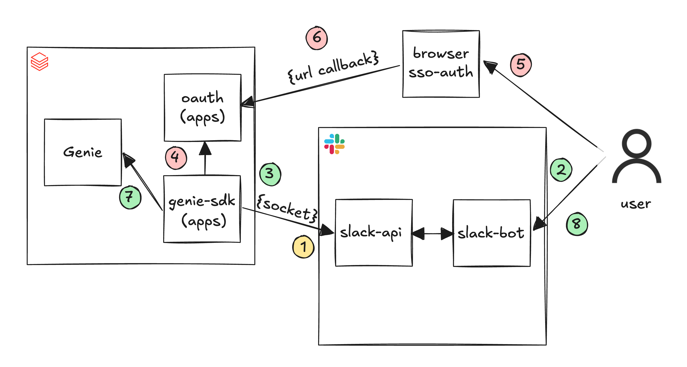
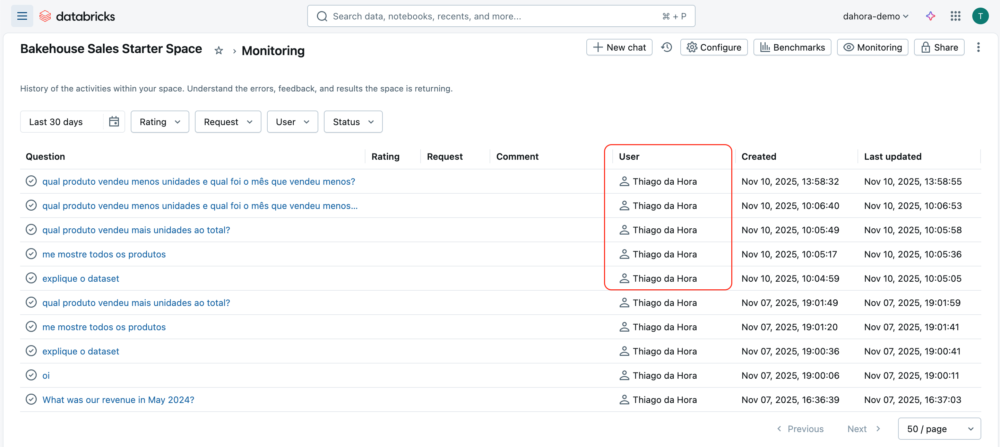

# Genie Slack App — OAuth On-Behalf-Of (OBO)

> Integração entre **Slack** e **Databricks AI/BI Genie** onde cada consulta roda **na identidade do usuário do Slack (OBO)** via OAuth — e não sob um service principal compartilhado. Row-Level Security, grants de Unity Catalog e logs de auditoria seguem o usuário real, ponta a ponta.

Dois Databricks Apps conversando entre si: um **broker OAuth** que mantém tokens por usuário em memória, e um **bot do Slack** que usa esses tokens pra falar com o Genie. Sem persistência — tokens vivem em memória e expiram em 1 hora.

---

## Sumário

- [TL;DR](#tldr)
- [Pré-requisitos](#pré-requisitos)
- [Arquitetura](#arquitetura)
- [Fluxo de funcionamento](#fluxo-de-funcionamento-8-passos)
- [Setup em 4 etapas](#setup-em-4-etapas)
  - [Etapa 1 — Databricks Apps · OAuth Broker](#etapa-1--databricks-apps--oauth-broker)
  - [Etapa 2 — Databricks Account · App Connection](#etapa-2--databricks-account--app-connection)
  - [Etapa 3 — Slack App](#etapa-3--slack-app)
  - [Etapa 4 — Databricks Apps · Genie + Slack](#etapa-4--databricks-apps--genie--slack)
- [Testando a integração](#testando-a-integração)
- [Rastreabilidade, auditoria e RLS](#rastreabilidade-auditoria-e-rls)
- [Detalhes técnicos](#detalhes-técnicos)
- [Troubleshooting](#troubleshooting)
- [Estrutura do projeto](#estrutura-do-projeto)

---

## TL;DR

| | |
|---|---|
| **Stack** | 2 Databricks Apps (Python) + Slack Socket Mode + Databricks AI/BI Genie |
| **Modelo de auth** | OAuth 2.0 OBO por usuário (3-legged) + Client Credentials M2M entre apps |
| **TTL do token** | 1h em memória · sem persistência em disco/DB |
| **Garantia chave** | Toda chamada ao Genie usa o token do usuário do Slack → RLS, UC grants e logs respeitam a identidade real |

## Pré-requisitos

- Workspace Databricks com **AI/BI Genie habilitado** e ao menos 1 Genie Space configurado com dados/instruções
- Permissão de **Account Admin** (pra criar App Connection no Account Console)
- Workspace do Slack onde você possa criar uma nova app
- (opcional) Databricks CLI autenticado pro caminho de deploy via CLI

---

## Arquitetura



Dois apps:

### `oauth-test-app` — OAuth Broker
- Implementa o fluxo OAuth 2.0 (Authorization Code) com o Databricks Account
- Armazena tokens por usuário **em memória** (válidos 1h, limpeza a cada 10min)
- Expõe endpoints REST: `/oauth/login`, `/oauth/callback`, `/oauth/token`, `/oauth/status`
- Recebe redirect do SSO e troca o code pelo access token

### `genie-slack-app` — Bot do Slack
- Conecta no Slack via **Socket Mode** (sem webhook público)
- Pra cada mensagem recebida, consulta o broker pra obter o token do usuário
- Cria um `WorkspaceClient` por usuário (não compartilhado entre threads)
- Chama o Genie via SDK usando aquele token; resposta volta pro Slack

### Comunicação entre os apps

Os apps falam por HTTP autenticado via **OAuth Client Credentials (M2M)**:
- O `genie-slack-app` recebe `DATABRICKS_CLIENT_ID` e `DATABRICKS_CLIENT_SECRET` **automaticamente injetados** pelo Databricks Apps (não precisa configurar)
- Usa essas credenciais pra obter um token M2M e autenticar suas chamadas ao `oauth-test-app`

---

## Fluxo de funcionamento (8 passos)

#### 1️⃣ Conexão Socket com Slack
O `genie-slack-app` abre uma conexão persistente Socket Mode com a Slack API — sem webhook público.

#### 2️⃣ Usuário interage com o bot
O usuário envia uma mensagem direta ou menciona o bot (ex: "Qual produto vendeu mais?").

#### 3️⃣ Mensagem chega via socket
A Slack API roteia a mensagem pelo socket pro `genie-slack-app`.

#### 4️⃣ Validação de autenticação
O bot consulta `oauth-test-app` (`/oauth/status?user_email=...`):
- **Sem token válido** → vai pro passo 5
- **Com token válido** → pula pro passo 7

#### 5️⃣ Solicita autenticação
O bot responde no Slack com um link de auth. O usuário clica e abre o SSO do Databricks no navegador.

#### 6️⃣ Callback e armazenamento do token
Após o login, o Databricks redireciona pro `oauth-test-app/oauth/callback`, que troca o `code` pelo access token e guarda em memória (válido por 1h).

#### 7️⃣ Consulta ao Genie
O bot busca o token (`/oauth/token?user_email=...`), instancia um `WorkspaceClient` daquele usuário e chama o Genie via SDK. Por usar o token do usuário:
- Permissões do Genie Space são respeitadas
- Row Level Security das tabelas é aplicada
- O log de auditoria registra o usuário real, não o SP

#### 8️⃣ Resposta ao usuário
O Genie devolve a resposta (filtrada pelas permissões do usuário) e o bot manda no Slack.

### Re-autenticação
Tokens expiram em **1 hora**. Após expirar, o usuário cai no passo 4 e refaz 5-6. Durante a validade, múltiplas perguntas reusam o mesmo token sem novo login.

---

## Setup em 4 etapas

### Etapa 1 — Databricks Apps · OAuth Broker

#### 1.1 Criar o app
1. No Databricks: **Compute** → **Apps** → **Create new app** → **Create a custom app**
2. **App name:** `oauth-test-app`
3. **Next: Configure** → **Create app**

#### 1.2 Preparar o `app.yaml`
**Antes** do deploy, configure o `app.yaml`:

```bash
cd oauth-test-app
cp app.yaml.example app.yaml
```

Edite `oauth-test-app/app.yaml` e atualize **apenas** o `DATABRICKS_HOST` apontando pra sua workspace:

```yaml
env:
  - name: "DATABRICKS_HOST"
    value: "https://sua-workspace.cloud.databricks.com"
```

Deixe `CLIENT_ID`, `CLIENT_SECRET` e `OAUTH_REDIRECT_URI` vazios — você preenche depois da Etapa 2.

> **Limpeza/expiração de tokens:** o `app.py` já está configurado pra limpar tokens a cada 10min e limitar a validade a 1h (`expires_in = min(expires_in, 3600)`).

#### 1.3 Deploy
1. No Databricks, abra o app `oauth-test-app`
2. Clique **Deploy**
3. Selecione a pasta com o código (`Workspace > Users > seu-usuario > oauth-test-app`)
4. **Select** e aguarde o deploy concluir

#### 1.4 Copiar a URL do app
Após o deploy você verá a URL no formato:
```
https://oauth-test-app-XXXXXXXXX.aws.databricksapps.com
```

⚠️ Não esqueça que o callback é a URL **+ `/oauth/callback`**:
```
https://oauth-test-app-XXXXXXXXX.aws.databricksapps.com/oauth/callback
```

Guarde essa URL — usada na Etapa 2.

---

### Etapa 2 — Databricks Account · App Connection

#### 2.1 Criar a App Connection
1. No **Account Console** (accounts.cloud.databricks.com): **Settings** → **App connections** → **Add connection**

#### 2.2 Configurar
| Campo | Valor |
|---|---|
| Application Name | `oauth-test-app` (ou outro nome descritivo) |
| Redirect URLs | URL do app **+ `/oauth/callback`** (passo 1.4) |
| Access scopes | **All APIs** (ou só **SQL** se você sabe que basta) |
| Generate a client secret | ✅ marcar |
| Access token TTL (minutes) | `60` |
| Refresh token TTL (minutes) | `10080` (7 dias) |

Clique **Save**.

#### 2.3 Copiar Client ID e Client Secret
Após salvar você verá:
- **Client ID** — uma string como `0209ee5b-dc86-485b-93b...`
- **Client Secret** — gerado uma única vez, **copie agora**

#### 2.4 Atualizar `app.yaml` e re-deployar
Volte ao `oauth-test-app/app.yaml` e preencha:

```yaml
env:
  - name: "DATABRICKS_HOST"
    value: "https://sua-workspace.cloud.databricks.com"
  - name: "CLIENT_ID"
    value: "<client-id-do-passo-2.3>"
  - name: "CLIENT_SECRET"
    value: "<client-secret-do-passo-2.3>"
  - name: "OAUTH_REDIRECT_URI"
    value: "https://oauth-test-app-XXXXXXXXX.aws.databricksapps.com/oauth/callback"
```

Faça **novo deploy** do `oauth-test-app` pra aplicar.

---

### Etapa 3 — Slack App

#### 3.1 Criar a Slack App
1. https://api.slack.com/apps → **Create New App** → **From scratch**
2. App Name: `genie-demo` (ou outro nome)
3. Selecione seu workspace

#### 3.2 Habilitar Socket Mode
1. Menu lateral: **Settings** → **Socket Mode** → ative **Enable Socket Mode**
2. Gere um **App-Level Token** (formato `xapp-1-...`) → este é o `SLACK_APP_TOKEN`

#### 3.3 Bot Token Scopes
Em **OAuth & Permissions** → **Bot Token Scopes**, adicione:

| Scope | Pra quê |
|---|---|
| `app_mentions:read` | Detectar @menções |
| `channels:history` | Ler mensagens de canais públicos onde o bot foi adicionado |
| `chat:write` | Enviar mensagens |
| `im:history` | Ler DMs |
| `im:read` | Ver info de DMs |
| `im:write` | Enviar DMs |
| `users:read` | Resolver info do usuário |
| `users:read.email` | Resolver e-mail do usuário (chave da auth) |

#### 3.4 Event Subscriptions
**Event Subscriptions** → ative **Enable Events** → em **Subscribe to bot events**:
- `app_mention` — quando alguém menciona o bot
- `message.im` — DMs pro bot

#### 3.5 Instalar no workspace
**Install App** → **Install to Workspace** → autorize.

Copie o **Bot User OAuth Token** (`xoxb-...`) → este é o `SLACK_BOT_TOKEN`.

---

### Etapa 4 — Databricks Apps · Genie + Slack

#### 4.1 Pegar o Genie Space ID
No Databricks, abra o Genie Space que você quer expor. Na URL:
```
https://<workspace>.cloud.databricks.com/genie/spaces/01f0b7fd8c6c10038125494d92425ce4
                                                      ─────── Space ID ───────
```

Esse é o `DATABRICKS_SPACE_ID`.

#### 4.2 Criar o app
**Compute** → **Apps** → **Create new app** → **Create a custom app** → nome `genie-slack-app` → **Create app**.

#### 4.3 Configurar `app.yaml`
```bash
cd genie-slack-app
cp app.yaml.example app.yaml
```

Edite `genie-slack-app/app.yaml` preenchendo **tudo**:
```yaml
env:
  - name: "SLACK_BOT_TOKEN"
    value: "xoxb-..."                      # passo 3.5
  - name: "SLACK_APP_TOKEN"
    value: "xapp-..."                      # passo 3.2
  - name: "DATABRICKS_SPACE_ID"
    value: "01f0b7fd8c6c10038125494d92425ce4"   # passo 4.1
  - name: "DATABRICKS_HOST"
    value: "https://sua-workspace.cloud.databricks.com"
  - name: "OAUTH_SERVICE_URL"
    value: "https://oauth-test-app-XXXXXXXXX.aws.databricksapps.com"  # URL da Etapa 1.4 (sem /oauth/callback)
```

#### 4.4 Deploy
**Deploy** → selecione a pasta `genie-slack-app` no workspace → **Select** → aguarde concluir.

#### 4.5 Copiar o Service Principal do app
Após o deploy, na aba **Overview** do `genie-slack-app`, copie o **App ID** / Service Principal (formato `app-XXXXXX`).

#### 4.6 Dar permissão Genie → OAuth
O `genie-slack-app` precisa **chamar** o `oauth-test-app`. No Databricks:

1. **Compute** → **Apps** → abra **`oauth-test-app`**
2. Aba **Permissions**
3. Adicione o service principal do `genie-slack-app` (passo 4.5) com permissão **Can Use**
4. **Save**

---

## Testando a integração

### 1. Mande a primeira mensagem
Abra o Slack, encontre o bot na lista de apps e envie um DM tipo `Bom dia!`.

### 2. Autentique
O bot responde com um link OAuth:
```
🔐 Você precisa se autenticar primeiro.

Clique aqui para autenticar:
https://oauth-test-app-XXXXX.aws.databricksapps.com/oidc/oauth2/v2.0/authorize?...

(Autenticando como: seu.email@empresa.com)
```

Clique no link → SSO Databricks → **Allow**.

### 3. Confirme
Você verá uma página de sucesso:
```
✅ Autenticação bem-sucedida!

Usuário: seu.email@databricks.com
Token armazenado e válido por 3600 segundos.

Você pode fechar esta janela e voltar ao Slack.
```

### 4. Pergunte ao Genie
Volte ao Slack e pergunte qualquer coisa em linguagem natural:


O token é reusado por **1 hora**. Depois desse período, o bot pede pra autenticar de novo.

---

## Rastreabilidade, auditoria e RLS

A grande vantagem desta arquitetura: **toda interação usa as credenciais do usuário real**, não as do service principal do app.

### Genie Monitoring

No Databricks → **Genie** → **Monitoring**, você vê na coluna **User** o nome do usuário do Slack (não o SP do app):



### Benefícios concretos

| Dimensão | Comportamento |
|---|---|
| **Rastreabilidade** | Cada consulta registrada com o usuário que perguntou. Audit log mostra o nome, não um SP genérico. |
| **Row Level Security** | RLS configurada nas tabelas é aplicada automaticamente — cada usuário vê só o que tem permissão. |
| **Unity Catalog grants** | Se o usuário não tem `SELECT` em uma tabela usada pelo Genie, ele não vê os dados via Slack. |
| **Controle individual** | Revogar acesso de um usuário ao Genie Space remove o acesso dele via Slack sem afetar os outros. |
| **Compliance** | Trilha de auditoria por usuário facilita LGPD/GDPR/SOX. |

### Exemplo prático

Imagine uma tabela `vendas` com RLS por região:
- **Usuário A** (Sul) → vê só vendas do Sul
- **Usuário B** (Norte) → vê só vendas do Norte

Ambos perguntam no Slack "qual foi a venda total?". A resposta é diferente pra cada um, porque o Genie roda com o token de cada um e a RLS é aplicada na hora.

---

## Detalhes técnicos

### Gerenciamento de tokens
- Tokens OAuth expiram em **1h** (3600s — limite imposto pelo broker via `min(expires_in, 3600)`)
- Cache de `WorkspaceClient` é invalidado após **55min**
- Tokens expirados são removidos do dicionário em memória a cada **10min**

### Comunicação entre apps
- **M2M (Client Credentials):** `DATABRICKS_CLIENT_ID` e `DATABRICKS_CLIENT_SECRET` são injetados automaticamente pelo Databricks Apps em **todo** app — não precisa configurar
- O `genie-slack-app` usa essas credenciais pra obter um token M2M e autenticar suas chamadas ao `oauth-test-app`

### APIs do `oauth-test-app`

| Endpoint | Método | Descrição |
|---|---|---|
| `/oauth/login?user_email=<email>` | GET | Retorna a URL de login OAuth pra esse usuário |
| `/oauth/callback?code=<code>&state=<state>` | GET | Callback do Databricks após SSO — troca code por token |
| `/oauth/token?user_email=<email>` | GET | Retorna o access token vigente (ou URL de login, se não autenticado) |
| `/oauth/status?user_email=<email>` | GET | Status da autenticação (autenticado/expirado/nunca logou) |

---

## Troubleshooting

<details>
<summary><strong>"Erro ao conectar com o serviço de autenticação"</strong></summary>

**Possíveis causas:**
- `OAUTH_SERVICE_URL` no `genie-slack-app/app.yaml` errado
- Permissão entre apps não configurada (passo 4.6)
- `oauth-test-app` não está rodando

**Fixes:**
1. Confira `OAUTH_SERVICE_URL` — deve ser a URL do oauth broker **sem** `/oauth/callback`
2. Em `oauth-test-app` → **Permissions**, confirme que o SP do `genie-slack-app` tem **Can Use**
3. Em `oauth-test-app` → **Logs**, procure erros
</details>

<details>
<summary><strong>"Invalid token" ou 403</strong></summary>

Token expirou (TTL de 1h). Mande qualquer mensagem nova no Slack — o bot detecta e oferece novo link de auth.
</details>

<details>
<summary><strong>Genie responde "No data available"</strong></summary>

**Possíveis causas:**
- `DATABRICKS_SPACE_ID` errado
- Usuário não tem acesso ao Space
- Space não tem dados/instruções configuradas

**Fixes:**
1. Confira o Space ID no `app.yaml` (copiado da URL do Genie)
2. No Genie Space → **Permissions**, confirme que o usuário tem acesso
3. Teste a mesma pergunta direto na UI do Genie com o usuário pra isolar
</details>

<details>
<summary><strong>"Parameter(s) present more than once: [state]"</strong></summary>

Configuração da App Connection errada. Confira que o `OAUTH_REDIRECT_URI` é exatamente `https://...databricksapps.com/oauth/callback` — sem query params extras.
</details>

<details>
<summary><strong>Bot não responde no Slack</strong></summary>

1. **Compute → Apps → genie-slack-app:** status deve estar **Running**
2. **Logs:** procure erros em vermelho
3. **Slack tokens:** confirme `SLACK_BOT_TOKEN` e `SLACK_APP_TOKEN` corretos; se trocou os tokens depois do deploy, refaça o deploy
4. **Socket Mode** habilitado na Slack App
</details>

---

## Deploy alternativo via CLI

```bash
databricks auth login --host https://sua-workspace.cloud.databricks.com

cd oauth-test-app
databricks apps deploy oauth-test-app --source-code-path .

cd ../genie-slack-app
databricks apps deploy genie-slack-app --source-code-path .
```

Você ainda precisa fazer todas as etapas de **configuração** (App Connection, Slack, Permissões cruzadas) na UI.

---

## Estrutura do projeto

```
pt-br/
├── README.md                     ← você está aqui
├── img/                          imagens do diagrama, screenshots
│   ├── architecture.png
│   ├── genie-monitoring.png
│   └── slack-bot.png
├── oauth-test-app/               Broker OAuth (app 1)
│   ├── app.py
│   ├── app.yaml                  gitignored (tem secrets)
│   ├── app.yaml.example
│   └── requirements.txt
└── genie-slack-app/              Bot do Slack (app 2)
    ├── app.py
    ├── app.yaml                  gitignored
    ├── app.yaml.example
    └── requirements.txt
```
